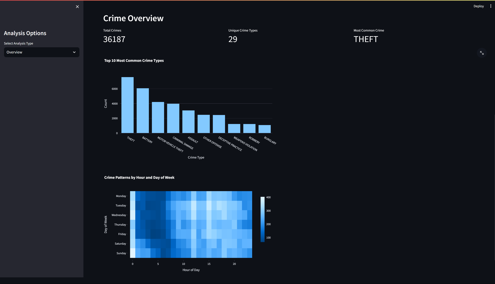
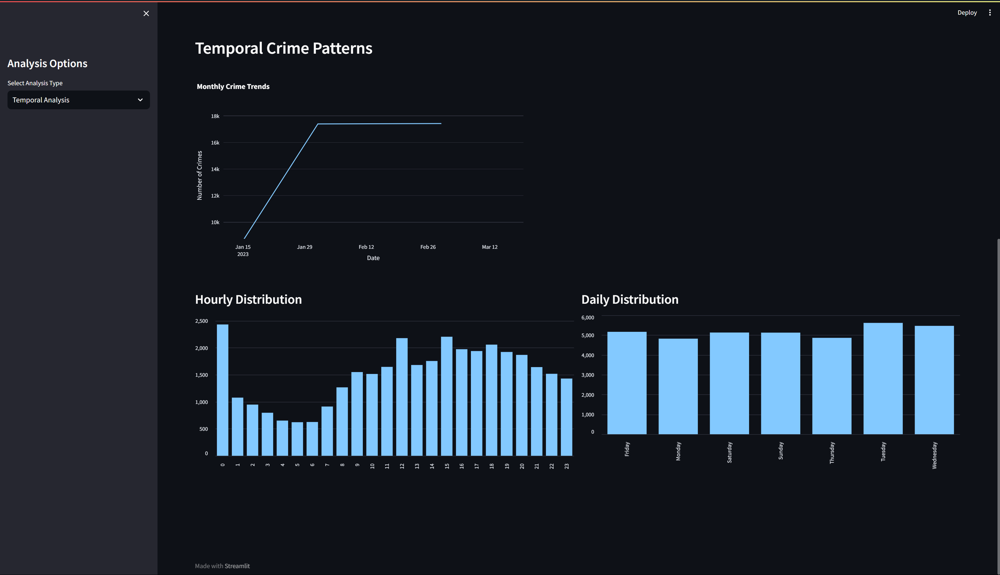
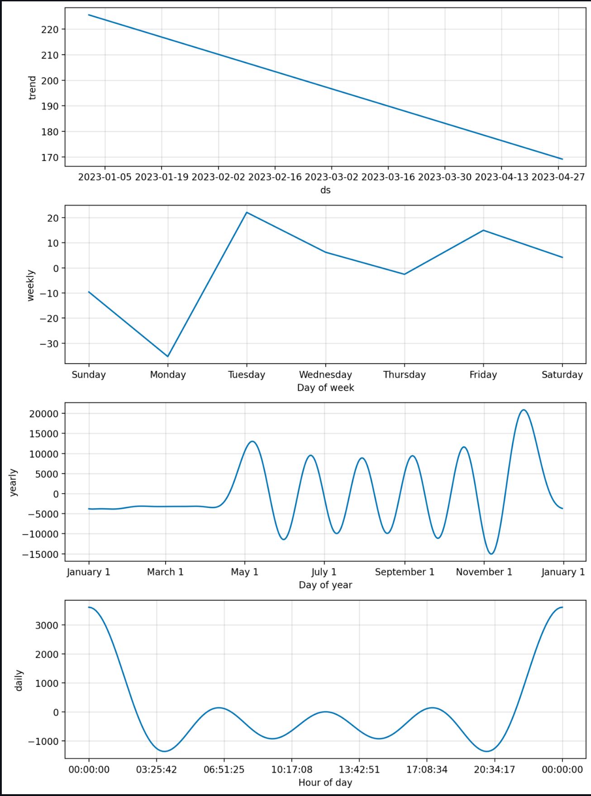
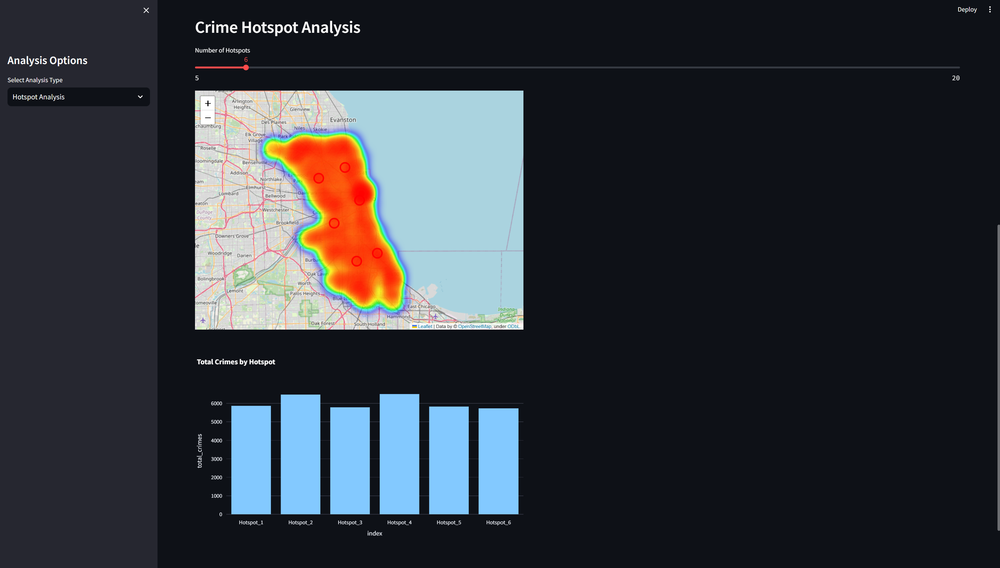

# Chicago Crime Analysis and Prediction System

## Project Overview
This project is an interactive dashboard for analyzing and forecasting crime patterns in Chicago using real-world data. It enables law enforcement, urban planners, and data scientists to identify crime hotspots, understand temporal trends, and predict future crime occurrences for better decision-making and resource allocation.

## Features
- **Crime Hotspot Detection:** K-Means clustering and interactive heatmaps to visualize high-crime zones on a Chicago map.
- **Temporal Analysis:** Visualize crime patterns by hour, day of week, and month.
- **Forecasting:** Predict future crime trends using Prophet time-series modeling.
- **Interactive Dashboard:** Streamlit-based UI for seamless exploration and insights.

## Technologies Used
- Python (pandas, numpy, matplotlib, seaborn, scikit-learn, folium, geopandas, plotly, prophet)
- Streamlit for dashboard UI
- Data: Chicago Crime dataset (Kaggle/Chicago Data Portal)

## Setup Instructions

1. **Clone the repository:**
   ```bash
   git clone https://github.com/omkar-sarwat/crime-Analysis-and-Prediction-System.git
   cd Crime-Analysis-and-Prediction-System
   ```

2. **Create and activate a virtual environment:**
   ```bash
   python -m venv venv
   venv\Scripts\activate
   ```

3. **Install dependencies:**
   ```bash
   pip install -r requirements.txt
   ```

4. **Download the Chicago Crime dataset** and place it in the `data` directory as `chicago_crime_data.csv`.

5. **Run the dashboard:**
   ```bash
   streamlit run app.py
   ```

## Usage
- The dashboard will automatically load the most recent 50,000 records for fast analysis.
- Use the sidebar to switch between Overview, Hotspot Analysis, Temporal Analysis, and Forecasting.
- All visualizations and predictions update interactively.

## Demo
Below are screenshots of the dashboard in action:

### Crime Overview


### Temporal Analysis


### Crime Forecasting


### Hotspot Analysis



**Feel free to fork, use, and extend this project for your own data science or civic tech initiatives!**

## Project Structure

- `data_processing.py`: Data cleaning and preprocessing
- `hotspot_detection.py`: K-Means clustering and hotspot analysis
- `time_series_analysis.py`: Temporal analysis and forecasting
- `visualization.py`: Map and statistical visualizations
- `app.py`: Streamlit dashboard
- `data/`: Place your `chicago_crime_data.csv` file here

## Data Source

The Chicago Crime dataset can be downloaded from Kaggle: [Chicago Crime Dataset](https://www.kaggle.com/datasets/chicago/chicago-crime) 